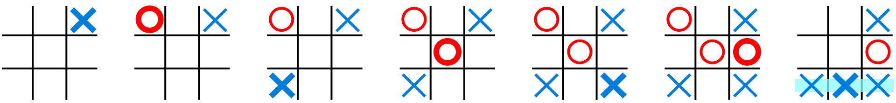

# Tic Tac Toe Game

> Tic-tac-toe Game is a console game for two players, X and O, who take turns marking the spaces in a 3×3 grid. The player who succeeds in placing three of their marks in a diagonal, horizontal, or vertical row is the winner. It is a solved game with a forced draw assuming best play from both players.

In order to win the game, a player must place three of their marks in a horizontal, vertical, or diagonal row.

The following example game is won by the first player, X:

Game of Tic-tac-toe, won by X
Players soon discover that the best play from both parties leads to a draw. Hence, tic-tac-toe is most often played by young children, who often have not yet discovered the optimal strategy.

## Built With

- Ruby

## Getting Started

In order to play or get a local copy you can clone this repository by using:

git clone git@github.com:iliebabcenco/tic-tac-toe.git

After cloning the repository, to play the game type ruby bin/main.rb in the terminal.

### Prerequisites

1. Ruby
2. Text Editor for Ruby

## Authors

👤 **Ilie Babcenco**

- GitHub: [@iliebabcenco](https://github.com/iliebabcenco)
- LinkedIn: [@iliebabcenco](https://www.linkedin.com/in/ilie-babcenco-72459a1b1/)
- Twitter: [@iliebabcenco](https://twitter.com/BabcencoIlie)

👤 **Marko Zecevic**

- GitHub: [@MarkoZecevic](https://github.com/MarkoNS1990)

## 🤝 Contributing

Contributions, issues, and feature requests are welcome!

Feel free to check the [issues page](../../issues/).

## Show your support

Give a ⭐️ if you like this project!
